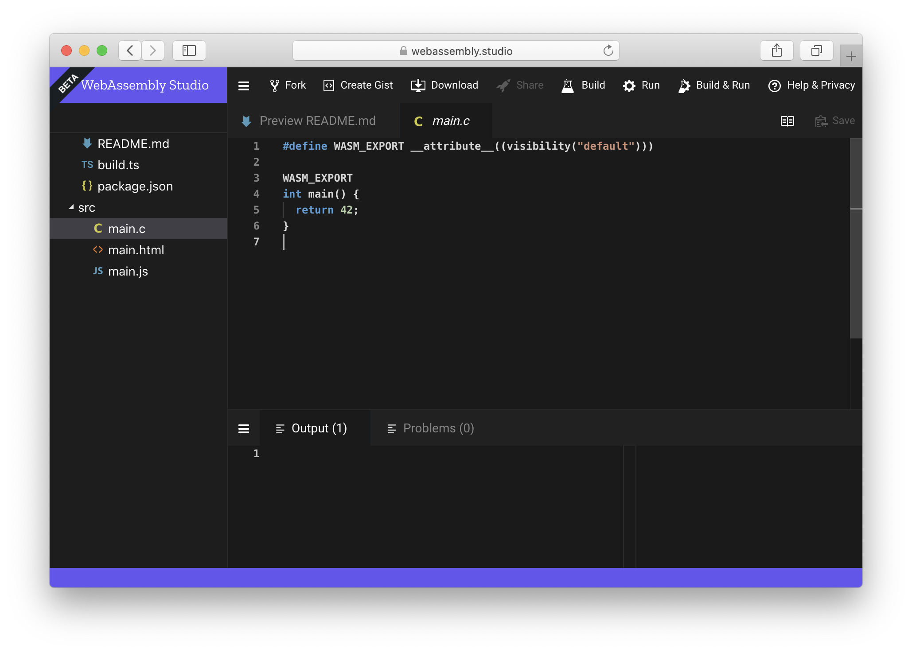
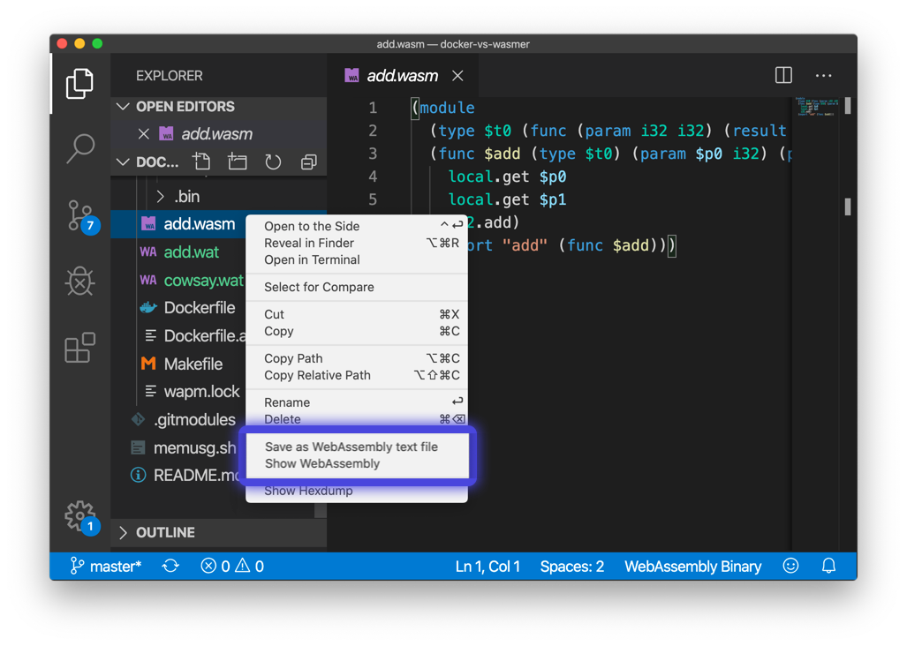

# Tooling & Ecosystem

The WebAssembly ecosystem is constantly growing. There are a lot of diverse tools that will help you enter the WebAssembly world with ease.

Here we will analyze the most popular ones:

### WebAssembly Studio

WebAssembly.Studio is an online IDE \(Integrated Development Environment\) that will help you learn and play with WebAssembly.

### Visual Studio Code Extension

There is a great extension for Visual Studio Code that adds WebAssembly support into the IDE.  
Including WebAssembly validation, and conversion to and from the binary and text format.

You can install the extension here:[ https://marketplace.visualstudio.com/items?itemName=dtsvet.vscode-wasm](https://marketplace.visualstudio.com/items?itemName=dtsvet.vscode-wasm)

### wabt

The WebAssembly Binary Toolkit. It's a collection of tools that let you manipulate WebAssembly files easily.

Here are their most popular ones:

* [**wat2wasm**](https://webassembly.github.io/wabt/doc/wat2wasm.1.html): translate from [WebAssembly text format](https://webassembly.github.io/spec/core/text/index.html) to the [WebAssembly binary format](https://webassembly.github.io/spec/core/binary/index.html)
* [**wasm2wat**](https://webassembly.github.io/wabt/doc/wasm2wat.1.html): the inverse of wat2wasm, translate from the binary format back to the text format \(also known as a .wat\)
* [**wasm-strip**](https://webassembly.github.io/wabt/doc/wasm-strip.1.html): remove sections of a WebAssembly binary file \(to optimize file size\)
* [**wasm-validate**](https://webassembly.github.io/wabt/doc/wasm-validate.1.html): validate a WebAssembly binary file



### Binaryen

Compiler infrastructure and toolchain library for WebAssembly.

Their most popular tool is:

* **wasm-opt**: Optimizes WebAssembly binaries to reduce file size or improve speed



### WAPM

The WebAssembly Package Manager. It's a centralized repository where developers and companies can install, publish and use WebAssembly packages.

You can visit the WAPM website here: [https://wapm.io/](https://wapm.io/)

## Server-side Runtimes

Right now there are tons of server-side runtimes. Here are the most popular ones \(alphabetically ordered\):

* [wasm3](https://github.com/wasm3/wasm3): a fast and lightweight interpreter that can execute WebAssembly in IoT devices
* [Wasmer](https://github.com/wasmerio/wasmer): a full WebAssembly JIT compatible with Emscripten and WASI
* [WAVM](https://github.com/wavm/wavm): a WebAssembly runtime based on LLVM compatible with WASI
* [Wasm-micro-runtime](https://github.com/bytecodealliance/wasm-micro-runtime): A micro runtime for WebAssembly

